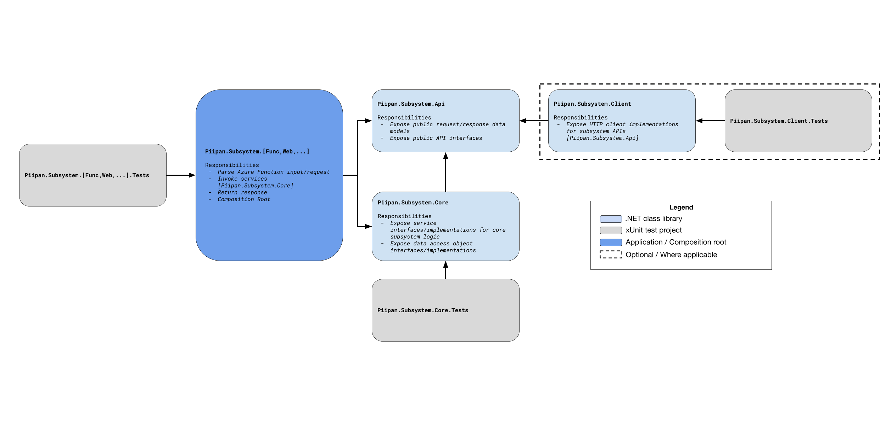

# 18. Standardize subsystem software architecture

Date: 2021-09-10

## Status

Accepted

## Context

The primary focus from a development standpoint thusfar has been to assemble a functional "walking skeleton." The aim has been to stand up the various, interconnected subsystems according to the proposed high-level architecture, with the hope that this would allow the ATO process to begin earlier.

As we move closer to the eventual handoff of this project to a vendor, it is becoming more important that we establish a consistent software architecture to be applied where applicable across the various subsystems. 

## Decision

We will adopt a standard architecture for the following subsystems:
- `dashboard`
- `etl`
- `match`
- `metrics`
- `query-tool`

For each subsystem, there will be a standard set of projects and project relationships. The following diagram illustrates the standard arrangement for a hypothetical subsystem called Subsystem. The arrows indicate a project-level dependency (e.g. `Piipan.Subsystem.Core` _depends on_ `Piipan.Subsystem.Api`).

  
  <!-- Google Drawing: https://docs.google.com/drawings/d/11XLxGcPnBwkubSuZdHXaQmwT5o9BjvQkH823wBXunhQ -->

#### `<namespace>.<subsystem>.Api`
The purpose of this project is to expose the public interfaces and data models for the subsystem. Typically, this would consist of the interface for each of the subsystem APIs along with all of the request and response objects necessary for interacting with those APIs. This project should contain no implementation - only [plain old CLR objects](https://en.wikipedia.org/wiki/Plain_old_CLR_object) and [C# interfaces](https://docs.microsoft.com/en-us/dotnet/csharp/language-reference/keywords/interface). As such, no tests are needed for this project.

#### `<namespace>.<subsystem>.Core`
The purpose of this project is to provide the core functionality for the subsystem. This is a pure .NET class library with no dependencies on web frameworks such as [Microsoft.NET.Sdk.Functions](https://www.nuget.org/packages/Microsoft.NET.Sdk.Functions/) or [Microsoft.AspNetCore.Mcv](https://www.nuget.org/packages/Microsoft.AspNetCore.Mvc/).

At the top level, the `Core` library should provide implementations for each of the API interfaces exposed in the `API` library.

#### `<namespace>.<subsystem>.[Func,Web,...]`
The purpose of this project is to expose the API for this subsystem to external callers. This may take the form of an Azure Function, a .NET Web API, a .NET web application, etc. In any case, this project should be restricted to managing the interaction with its particular framework. In the case of an Azure Function or Web API, this means simply handling authentication/authorization,  parsing incoming HTTP requests, invoking `Core` services, and serializing HTTP responses.

#### [OPTIONAL] `<namespace>.<subsystem>.Client`
The purpose of this project is to provide implementations for each of the API interfaces exposed in the `API` library. Unlike the implementations in the `Core` library, these are HTTP client implementations which interact with the corresponding web service or function app for this subsystem. If there is no HTTP service for a particular subsystem, this project should be omitted. 

## Consequences

We expect that adopting a consistent subsystem architecture will ease the onboarding process for new developers and perhaps reduce the amount of documentation required for each subsystem.

Additionally, decoupling subsystem logic and data access from particular HTTP and Azure frameworks will make the system as a whole more portable -- in theory, only the `.[Func,Web]` project would need to be replaced to change or extend the operating environment for a subsystem (e.g. to run as a Web API instead of an Azure Function).

Lastly, we expect that implementing the `Core` logic as a standalone library will improve our ability to extend and test subsystem functionality.