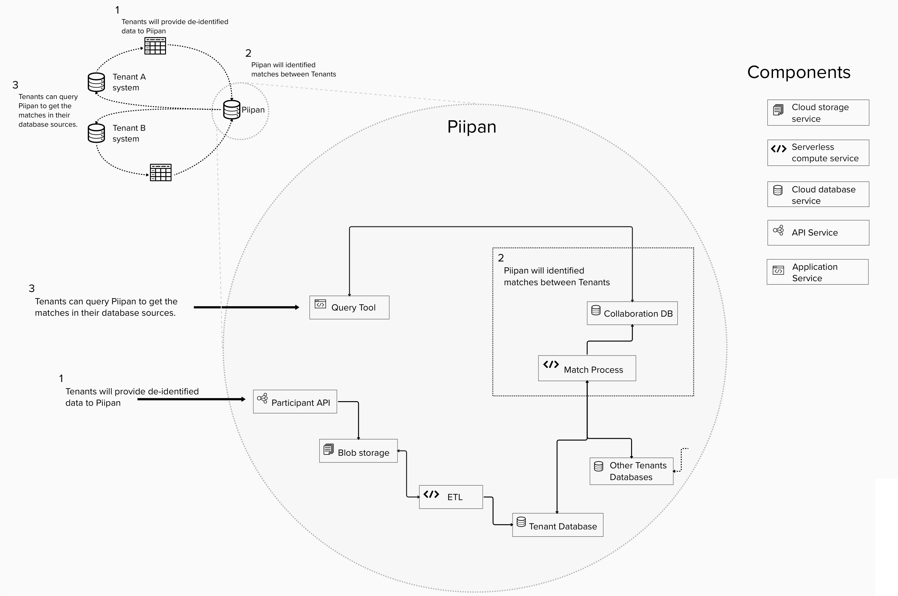

## High-level architecture

Piipan is designed to be a cloud-native system. It is under active development and is not complete. Several subsystems have been implemented; others are anticipated and indicated with an asterisk.

* [Extract-Transform-Load (ETL)](../etl)
* [Active Match Orchestrator API](../match)
* [Query Tool & Collaboration app](../query-tool)
* [Dashboard app](../dashboard)
* [Metrics](../metrics)
* Collaboration API\*
* Batch-driven Bulk Match\*
 
Here is a diagram depicting these anticipated subsystems:

  
  <!-- Google Drawing: https://docs.google.com/drawings/d/1iSC5M6pxcnfV_LoqTnSGgZ9U4TZTbfPf4CpHCv001ug/ -->

A guiding architectural principle is to treat organizations and their data as tenants of a platform (i.e., Piipan), and accordingly apply isolation best practices and the principle of least privilege throughout the system.

Finally, this reference model is designed to be extended to support a fully federated system, whereby PII records never leave tenant-run enclaves in bulk. Under this hypothetical extension, the federally-run API orchestrator would reach back to each tenant, rather than its own isolated copies of tenant data records. And the bulk match API would incorporate a Privacy Set Intersection (PSI) protocol, with the federal system acting as a semi-trusted 3rd party. 

## Implementation

Piipan targets Microsoft Azure as its cloud computing platform, but generally selects for commoditized features that are available on other cloud platforms.

To expedite development and compliance processes, Piipan maximizes the use of managed services, including Function-as-a-Service (FaaS). No virtual machines or containers are directly employed in the production system.

Piipan's programming languages and frameworks include: .NET Core, C#, and ASP.NET using Razor Pages. Bash and ARM templates are used for Infrastructure-as-Code.

Our processes and code are intended to be platform agnostic: the 18F team primarily uses macOS-hosted local development tools and the managed services use a mix of Windows and Linux.

Piipan uses the monorepo strategy; subsystems get their own top-level directory and are independently deployable modulo any shared datastores. A system-wide CircleCI configuration manages continuous integration and deployment.
