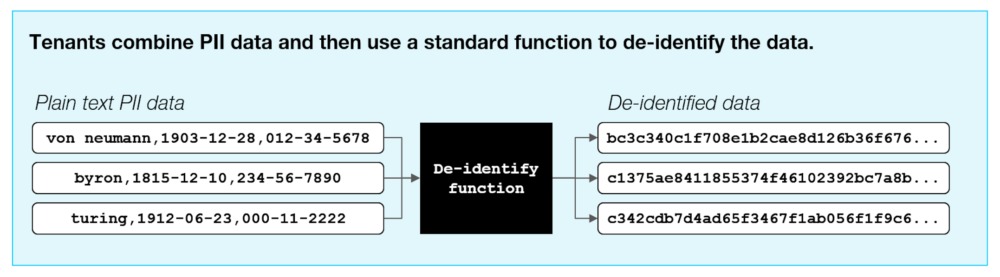
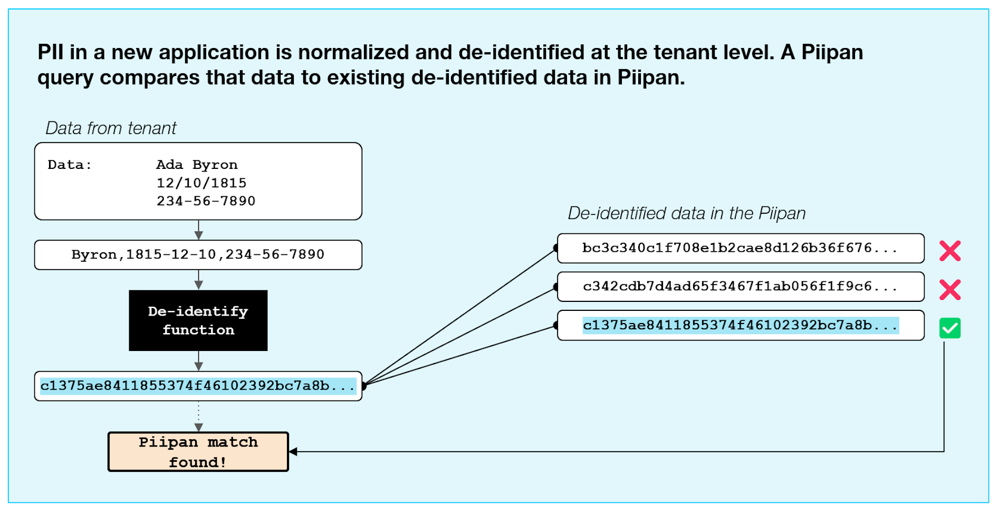
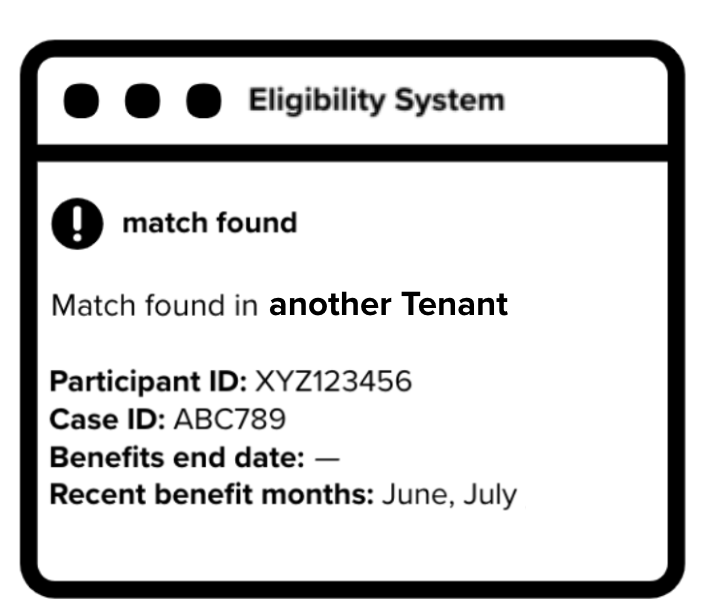

# Building the Piipan to protect PII

We’re designing the Piipan so the system doesn’t store sensitive personally identifiable information (PII). That means there will be no database that directly stores names, dates of birth, or social security numbers.

A high-level description of our approach is below; a [detailed technical specification](./pprl.md) is also available.

## How are we building the Piipan so it doesn’t store PII? 

In order for the Piipan to work, tenants will upload de-identified data to the Piipan on a daily basis. Tenants will use a tool to de-identify the PII before uploading this data to the Piipan. Each person’s PII is converted to a seemingly-random string of characters that acts as a de-identified code for that individual: the exact same PII always produces the same code. 

  
  <!-- Google Slides: https://docs.google.com/presentation/d/1Lctqx9EuGvC9M5PGgQK6zXSiMfUWyafaX00KlZDhx4c/edit#slide=id.ged2784a5aa_0_456 -->

Tenants will combine last name, DOB, and SSN into a single field to be de-identified and compared against other codes uploaded to the Piipan from other tenants. Tenants will also upload less-sensitive data associated with the individual (Individual ID, Case ID, recent benefits months), but this will not be used in the match. When two tenants upload PII records that produce the same code, it will be flagged by the Piipan as a match.  

  
  <!-- Google Slides: https://docs.google.com/presentation/d/1Lctqx9EuGvC9M5PGgQK6zXSiMfUWyafaX00KlZDhx4c/edit#slide=id.ged2784a5aa_0_484 -->

When an exact match of de-identified data is found between tenants, both tenants—Tenant A (the tenant that initiated the Piipan query) and Tenant B (where the match was found)—will be notified and will receive the plain-text data associated with the match. Using this plain-text data (Individual ID, Case ID, Benefits end date, Recent benefits months), both tenants will work together to resolve the match and take timely action on the case. 

  
  <!-- Google Slides: https://docs.google.com/presentation/d/1Lctqx9EuGvC9M5PGgQK6zXSiMfUWyafaX00KlZDhx4c/edit#slide=id.ged2784a5aa_1_0 -->

As a result, the Piipan will not directly store sensitive PII. The de-identification process protects against PII being exposed or used for purposes other than those intended. It is theoretically possible that a sophisticated attacker could use the information stored in the Piipan to extract PII, but this risk is greatly reduced by combining last name, DOB, and SSN before the de-identification process.

## Privacy-Preserving Record Linkage (PPRL)

This de-identification technique is part of an approach called Privacy-Preserving Record Linkage (PPRL). PPRL is a process that identifies and links records that correspond to the same individual across different databases, without revealing private information to the linking organization. It’s a well-researched approach commonly used by the healthcare industry to keep sensitive medical information secure. (Read more: [Journal of the Medical Informatics Association](https://www.ncbi.nlm.nih.gov/pmc/articles/PMC5009931/))
