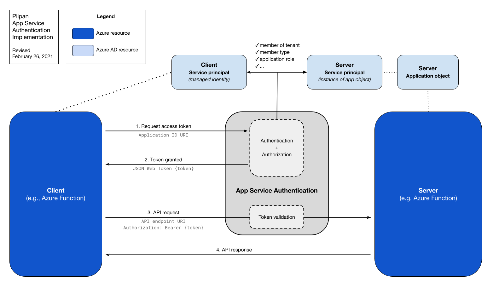

# Securing internal APIs

Piipan's micro-service architecture consists of several internal APIs used to expose underlying data (e.g., participant data, metrics, and collaboration records). These APIs are deployed to the Azure environment in the form of Azure Functions. Clients — typically, but not exclusively, in the form of App Service apps or other Azure Functions — call the APIs via endpoints in the form of [HTTP triggers](https://docs.microsoft.com/en-us/azure/azure-functions/functions-bindings-http-webhook-trigger?tabs=csharp).

When you create a Function App in Azure, its endpoint is publicly accessible by default. Rudimentary security can be configured in the form of [shared access keys](https://docs.microsoft.com/en-us/azure/azure-functions/functions-bindings-http-webhook-trigger?tabs=csharp#authorization-keys) or [IP restrictions](https://docs.microsoft.com/en-us/azure/azure-functions/functions-networking-options#inbound-access-restrictions), but neither are considered sufficient outside of development environments.

To secure endpoints in production, the APIs use [App Service Authentication](https://docs.microsoft.com/en-us/azure/app-service/overview-authentication-authorization) (sometimes referred to as "Easy Auth") with Azure Active Directory (Azure AD) configured as the authentication service. Azure AD uses OpenID Connect for authentication and OAuth 2.0 for authorization, though App Service Authentication largely abstracts these implementation details away from developers. Conveniently, App Service Authentication also alleviates the need to manually manage and rotate internal API credentials.

Once secured, the APIs are protected from unauthorized access both externally and internally, consistent with the aims of a [Zero Trust Architecture](https://csrc.nist.gov/publications/detail/sp/800-207/final).

Another layer of security we employ is routing internal communication between as many Azure resources as possible over a Virtual Network, in order to block exposure to the public internet and decrease the attack surface of the system.

This document details how the internal APIs are utilized, how to secure them, how to authorize client applications, how to set up a virtual network, and defines the various objects involved in the process.

## Table of contents
- [Securing internal APIs](#securing-internal-apis)
  - [Table of contents](#table-of-contents)
  - [API model](#api-model)
  - [Resources involved](#resources-involved)
  - [Configuring the server](#configuring-the-server)
  - [Configuring the client](#configuring-the-client)
  - [Making authenticated API calls](#making-authenticated-api-calls)
  - [Working locally](#working-locally)
  - [Definitions](#definitions)
    - [Access token](#access-token)
    - [App Service Authentication](#app-service-authentication)
    - [Application ID URI](#application-id-uri)
    - [Application Object](#application-object)
    - [Application registration](#application-registration)
    - [Application roles](#application-roles)
    - [Service Principal — in the context of an application object](#service-principal--in-the-context-of-an-application-object)
    - [Service Principal — in the context of a system-assigned identity](#service-principal--in-the-context-of-a-system-assigned-identity)
  - [Miscellaneous notes](#miscellaneous-notes)
  - [Virtual Network Integration](#virtual-network-integration)

## API model

Piipan's internal APIs follow a traditional client–server model where communication between a client and server is done with sets of requests and responses. With authentication enabled, that model is extended to establish the following generalized workflow:

1. The client identifies itself to the server's authentication service and requests an access token
1. The server's authentication service authenticates the client, performs authorization, and responds with an access token
1. The client sends a standard HTTP request to the server, including the access token in the request's `Authorization` header
1. The server's authentication service validates the access token and allows the request through to the server
1. The server returns a response to the client

## Resources involved

In the Azure environment, the resources involved in authenticated client–server communication are divided between two domains:
- Azure resources (e.g., Azure Functions, App Service apps, database clusters, etc) and
- Azure AD resources (e.g., application objects, service principals, user accounts, etc).
Azure resources provide the application logic (i.e., sending requests and responses), while their related Azure AD resources handle authentication and authorization.

When an Azure resource is created it is effectively unknown to Azure AD. For the resource to make use of Azure AD's authentication and authorization functionality it must first create and configure a resource in Azure AD that will act as its representative. This representative resource is called a service principal. This is true for all Azure resources, both on the client side and server side.

## Configuring the server

Once an API server is deployed in the form of an Azure Function, the following steps are taken to create and configure the necessary Azure AD resources to perform authentication and authorization:

1. An [application object](#application-object) is created to function as the server's representative in Azure AD. By convention, the application object shares the same name as the server's Azure Function. The application object defines certain properties of the server for the purposes of authentication:
    - *[Application ID URI](#application-id-uri)*: used by clients to request access tokens. The URI value is set to the [Azure AD default schema](https://docs.microsoft.com/en-us/azure/active-directory/develop/security-best-practices-for-app-registration#appid-uri-configuration) of `api://<app-id>`.
    - *[Application role](#application-roles)*: an application-specific role (e.g., `StateApi.Query` or `OrchestratorApi.Query`) that is assigned to authorized clients.
    - *Supported account types*: a setting which determines whether or not the server will accept clients originating from Azure AD tenants external to Piipan's. This setting is set to only allow clients originating within Piipan's tenant.
1. A [service principal](#service-principal--in-the-context-of-an-application-object) is created to serve as the *local instance* of the application object in Piipan's Azure AD tenant (see the [application object definition](#application-object) for more detail on the distinction between global and local). The service principal inherits the application object's configuration/definitions (including name), and is configured with one additional detail:
    - Its `appRoleAssignmentRequired` setting is set to `true`. This enforces the requirement that any clients which attempt to authenticate with the server are assigned one of the application object's application roles.
1. The Azure Function's [App Service Authentication](#app-service-authentication) functionality is enabled and configured with the following details:
    - The authentication method is set to use Azure AD
    - The Azure Function's Azure AD representative is set to the application object created above
    - The "token issuer URL" is set to the standard issuer URL for the Azure environment. E.g., `https://login.microsoftonline.com/{azure-ad-tennant-id}/` for Azure Commercial (using `az cloud show --query endpoints.activeDirectory` to discover the endpoint for the current cloud environment).

At this point, authentication is fully configured and implemented on the server side. Specifically, the server will use Azure AD to authenticate clients. Access tokens will be issued to clients that are members of the server's tenant *and* are assigned at least one of the application roles defined in the server's representative application object. Any requests from clients that do not conform to that policy will result in `401 unauthorized` responses.

## Configuring the client

Clients using Piipan's internal APIs typically take the form of an Azure Function or App Service app. Similar to the server resources, these types of clients are Azure resources and must create a resource in Azure AD to serve as their representative during authentication authorization. This is done by enabling the client's system-assigned identity, which in turn creates a [service principal](#service-principal--in-the-context-of-a-managed-identity) in Azure AD.

Additionally, as explained above, the client's identity (i.e., service principal) must be [assigned one of the server's application roles](#application-roles). Application roles are assigned to the client's identity by the server's service principal.

## Making authenticated API calls

With the server's authentication and authorization mechanisms configured and the client's identity enabled and assigned one of the server's application roles, the client can successfully make calls to the protected API. Calls are made according to the flow described in [the API model section](#api-model). This flow can now be reiterated using the specifics of App Service Authentication:

1. The client, represented by its system-assigned identity (i.e., service principal), identifies itself to the server's local service principal and requests an access token by sending a request to the application object's `application ID URI`.
1. The server's authentication service, Azure AD, authenticates the client, ensures it is assigned an application role, performs authorization, and responds with an authorized access token
1. The client sends a standard HTTP request to the server and includes the access token in the request's `Authorization` header
1. The server's authentication service, Azure AD, validates the access token and allows the request through to the server
1. The server returns a response to the client

An illustrated version of this flow:

<p align="center">
  <a href="./diagrams/piipan-internal-authentication.png"></a>
  <!-- Google Drawing: https://docs.google.com/drawings/d/1PlAZwHBbf1QkRC4LDkce7FmnUq25veJGj2Vafyj9-FY/edit?usp=sharing -->
</p>

## Working locally

Developers occasionally need to connect locally running applications to remote APIs to perform testing. With App Service Authentication enabled, API requests that originate locally must follow the same authentication approach outlined above. However, instead of using a service principal, developers can use their locally authenticated CLI user:

1. Log in to the AZ CLI:
```
az login
```

2. Use `assign-app-role` to assign your user account the necessary [application role](#application-roles):
```
./tools/assign-app-role.bash <azure-env> <function-app-name> <app-role-name>
```

3. Use `authorize-cli` to add the Azure CLI as an authorized client application for the Function's application registration:
```
./tools/authorize-cli.bash <azure-env> <function-app-name>
```

4. Modify the application to conditionally use the CLI to obtain access tokens when running locally. The specific approach will vary application to application, but may resemble (assuming the use of `Piipan.Shared.Authentication`):
```
ITokenProvider tokenProvider;
if (_env.IsDevelopment())
{
    tokenProvider = new CliTokenProvider();
}
else
{
    tokenProvider = new EasyAuthTokenProvider();
}
```

## Definitions

The key components described in this document are defined below, alphabetically. Definitions are written within the context of App Service Authentication. They are not intended to be exhaustive and omit details that might apply in different contexts. Definitions which refer to an Azure or Azure AD resource include details for managing the resource via the Azure Portal, Azure CLI tool, and, where possible, [ARM templates](https://docs.microsoft.com/en-us/azure/azure-resource-manager/templates/overview).

### Access token

A JSON Web Token (JWT) granted to a client from a server. The token represents the server's authorization to use its resources. Client applications retrieve access tokens using the [`Azure.Identity` client library](https://docs.microsoft.com/en-us/dotnet/api/overview/azure/app-auth-migration). Tokens are requested from the server via its application object's [application ID URI](#application-id-uri). Piipan has a shared authentication library (`Piipan.Shared.Authentication`) which abstracts away some of the complexity of requesting/using access tokens when calling internal APIs.

**Retrieving access tokens**
- *Azure CLI*: Access tokens are usually retrieved at the code-level, but can be retrieved via the CLI for *users* using [`az account get-access-token`](https://docs.microsoft.com/en-us/cli/azure/account?view=azure-cli-latest#az_account_get_access_token)

**Relevant documentation**
- [Microsoft identity platform developer glossary](https://docs.microsoft.com/en-us/azure/active-directory/develop/developer-glossary#access-token)

### App Service Authentication

App Service Authentication is the name for the out-of-the-box authentication support built into Azure App Service apps and Azure Functions. It is also referred to as "Easy Auth," a name still found in some Microsoft documentation.

When enabled, all HTTP requests sent to the Azure resource pass through the authentication mechanism before being handled by the application itself.

All configuration is done through the associated Azure and Azure AD resources (e.g., the Function app, application object, service principal, etc.).

**Managing App Service Authentication**
- *Portal*: {your application} > Authentication / Authorization
- *Azure CLI*: [`az webapp auth`](https://docs.microsoft.com/en-us/cli/azure/webapp/auth?view=azure-cli-latest) (despite being under the `webapp` namespace, the same command is used when configuring authentication for Azure Functions)

**Relevant documentation**
- [Authentication and authorization in Azure App Service and Azure Functions](https://docs.microsoft.com/en-us/azure/app-service/overview-authentication-authorization)

### Application ID URI

A valid URI string defined on an [application object](#application-object). This URI is used for specifying the resource from which the client should request an [access token](#access-token) for authenticating with the server. The URI can be set to any value unique to the tenant, but [Azure AD specifies a default value](https://docs.microsoft.com/en-us/azure/active-directory/develop/security-best-practices-for-app-registration#appid-uri-configuration) of `api://<app-id>` where `<app-id>` is the application object's application (aka "client") ID.

**Managing the application ID URI**
- *Portal*: Azure Active Directory > App registration > All applications > {your application object} > Application ID URI
- *Azure CLI*: The `--identifier-uris` parameter / `identifierUris` property when using `az ad app [create / show / update]`

### Application Object

An application object is an Azure AD resource and the *output* of the application registration process. By establishing a relationship with an application object, the API server asserts that it trusts Azure AD to perform identity services in accordance with the application object's configuration.

Application objects are accessed via the Azure AD tenant in which they were created, but are *global* resources. This supports the use case where a server application in a single tenant can be accessed by clients/identities spread across multiple tenants. This paradigm has a implementation implication: the global application object needs an instance of itself in every tenant which houses a client/identity. These local instances of application objects are call [service principals](#service-principal--in-the-context-of-an-application-object). Even if a server application will only be accessed by client identities in its own tenant it must have both an application object and a service principal.

**Managing application objects**
- *Portal*: Azure Active Directory > App registrations > All applications
- *Azure CLI*: [`az ad app`](https://docs.microsoft.com/en-us/cli/azure/ad/app?view=azure-cli-latest)

**Relevant documentation**
- [Application and service principal objects in Azure Active Directory](https://docs.microsoft.com/en-us/azure/active-directory/develop/app-objects-and-service-principals#application-registration)

### Application registration

The *action* that results in an application object. Application registration is primarily relevant in the context of the Azure Portal where it is a step-by-step wizard for creating an application object. When creating an application object through infrastructure-as-code, there is no formal "application registration" process. It is part and parcel with the command to create the application object.

As noted below, "Application registrations" is also the name of the navigation item in the Azure Portal under which application objects are found and managed.

**Relevant documentation**
- [Application and service principal objects in Azure Active Directory](https://docs.microsoft.com/en-us/azure/active-directory/develop/app-objects-and-service-principals#application-registration)

### Application roles

Application roles — also referred to as app roles — are custom roles defined within an application object. They can be assigned to client identities (service principals) and are included as `claims` in access tokens. Assignment is done through the application object's service principal.

App roles can be used to enforce additional levels of authorization during the authentication process. This is primarily done through two mechanisms:

1. They can be configured to be assignable to only users/groups, only applications, or both user/groups and applications.
1. An application object's service principal can be configured to only authenticate clients who have been assigned an app role. This is done by setting the service principal's `appRoleAssignmentRequired` property to `true`.

Further security enforcement can be done the application-level by inspecting the access token's `claims` property. This functionality is not currently utilized by any of Piipan's APIs.

App role names are arbitrary but by convention are named according to the format `{resource}.{action}`.

App roles are different from Azure roles used in role-based access control (Azure RBAC).

**Managing the application roles**
- *Portal*:
    - When creating/managing application roles:
        - Azure Active Directory > App registration > All applications > {your application object} > App roles | Preview
        - Azure Active Directory > App registration > All applications > {your application object} > Manifest
    - When managing a client service principal's assignments (note: assignments can only be *viewed* when using the portal; assignment is performed via the CLI):
        - Azure Active Directory > Enterprise applications > Application type: Managed Identities > {your service principal} > Permissions
- *Azure CLI*:
    - When creating/managing application roles:
        - The `--app-roles` CLI parameter / `appRoles` property when using `az ad app [create / show / update]`
    - When managing application role assignments:
        - To assign application roles: the [`appRoleAssignedTo` REST endpoint](https://docs.microsoft.com/en-us/graph/api/serviceprincipal-post-approleassignedto?view=graph-rest-1.0&tabs=http) when using `az rest`
        - To view a service principal's assigned roles: the [`appRoleAssignments` REST endpoint](https://docs.microsoft.com/en-us/graph/api/serviceprincipal-list-approleassignments?view=graph-rest-1.0&tabs=http) when using `az rest`

**Relevant documentation**
- [How to: Add app roles to your application and receive them in the token](https://docs.microsoft.com/en-us/azure/active-directory/develop/howto-add-app-roles-in-azure-ad-apps#declare-roles-for-an-application)

### Service Principal — in the context of an [application object](#application-object)

In the context of an application object, a service principal is the *local* (to the Azure AD tenant) instance of the application object. To use a programming paradigm, the service principal is the *instance* of the application object's *class*. The service principal inherits all of the application object's configuration and can be configured with additional tenant-specific details. Piipan makes use of one of these details, setting `appRoleAssignmentRequired` to `true`. With this setting, the service principal will only authenticate clients represented by a service principal that has been assigned an application role.

**Managing an application object's service principal**
- *Portal*:
    - Azure Active Directory > App registration > All applications > {your application object} > Managed application in local directory
    - Azure Active Directory > Enterprise applications > Application type: All Applications > {your service principal}
- *Azure CLI*:
    - [`az ad sp`](https://docs.microsoft.com/en-us/cli/azure/ad/sp?view=azure-cli-latest)

**Relevant documentation**
- [Application and service principal objects in Azure Active Directory](https://docs.microsoft.com/en-us/azure/active-directory/develop/app-objects-and-service-principals#service-principal-object)

### Service Principal — in the context of a system-assigned identity

A system-assigned identity is a form of managed identity that is tied to the lifetime of an Azure resource. Enabling a resource's system-assigned identity creates a service principal in Azure AD. This service principal acts as the Azure resource's identity when it is acting as the client during the authentication and authorization process.

If the Azure resource is destroyed, so to is its system-assigned identity's service principal.

**Managing a managed identity's service principal**
- *Portal*:
    - Azure Resource (e.g., Azure Function) > Identity > System assigned
    - Azure Active Directory > Enterprise applications > Application type: Managed identities > {your application object}
- *Azure CLI*:
    - [`az functionapp identity`](https://docs.microsoft.com/en-us/cli/azure/functionapp/identity?view=azure-cli-latest) for an Azure Function's identity
    - [`az webapp identity`](https://docs.microsoft.com/en-us/cli/azure/webapp/identity?view=azure-cli-latest) for an App Service app's identity
- *ARM template*:
    - `identity` property on a [`Microsoft.Web/sites` object](https://docs.microsoft.com/en-us/azure/templates/microsoft.web/sites#microsoftwebsites-object)

**Relevant documentation**
- [What are managed identities for Azure resources?](https://docs.microsoft.com/en-us/azure/active-directory/managed-identities-azure-resources/overview)

## Miscellaneous notes

- Some Azure resources can function as *both* a client *and* a server. Take for example Piipan's Orchestrator API. When it is *called* by the Query Tool, it is operating as the server. When it is *calling* the individual tenant APIs, it is operating as the client. In this case the Orchestrator API has two service principals: one for its system-assigned identity when operating as a client, and one for its local application object instance when it is operating as a server.
- App Service Authentication [handles all HTTP requests](https://docs.microsoft.com/en-us/azure/app-service/overview-authentication-authorization#on-windows) before they reach the application. Any requests that reach the application have already been authorized. Consequently, when an Azure Function is utilizing App Service Authentication, the application itself is configured with an [`AuthLevel` of `Anonymous`](https://docs.microsoft.com/en-us/azure/azure-functions/functions-bindings-http-webhook-trigger?tabs=csharp#configuration).

## Virtual Network Integration

Azure Private Links, Private Endpoints, and Virtual Networks (VNets) can be used to achieve a virtualized and entirely private network for communication between Azure resources.

Microsoft documentation on this subject is extensive, and specific implementation varies between resource types (see documentation below for a starting point). For more on why we decided to use Private Endpoints over other options, read the [Decision Record](./adr/0013-use-private-links.md).

Here’s a brief overview of how these resources fit together, using a Postgres database server and a Function App that communicates with it as an example:

1. A VNet is established, with subnets dedicated to certain resource types.
1. For the database server, a private link is created and claims one of the VNet’s subnets.
1. An App Service plan is created for the function app and any other apps needing to talk to this database server, claiming another one of the VNet’s subnets.
1. The function app is put onto the App Service plan, allowing it to be integrated into the Vnet.
1. Once an app is integrated into the VNet, it will automatically use the database server’s private link to communicate with it.
1. Public access to the database server is then disabled, allowing only resources in the VNet to communicate with it.

**Relevant documentation**

- [What is Azure Private Endpoint?](https://docs.microsoft.com/en-us/azure/private-link/private-endpoint-overview)
- [What is Azure Private Link?](https://docs.microsoft.com/en-us/azure/private-link/private-link-overview)
- [Private Link for Azure Database for PostgreSQL-Single server](https://docs.microsoft.com/en-us/azure/postgresql/concepts-data-access-and-security-private-link)
